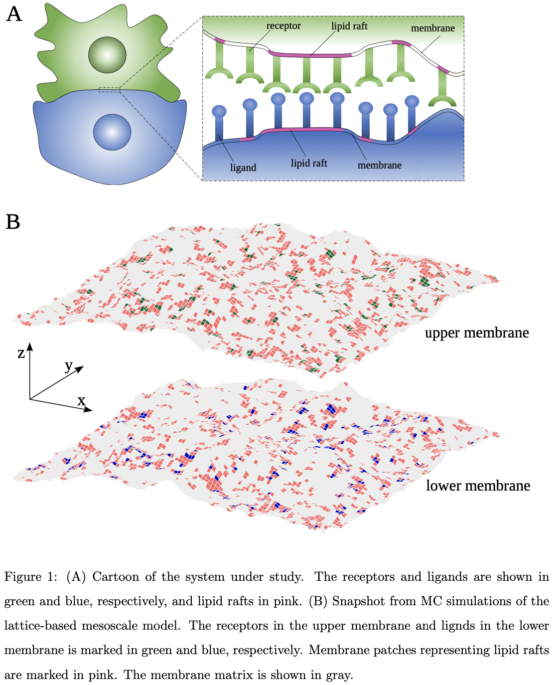
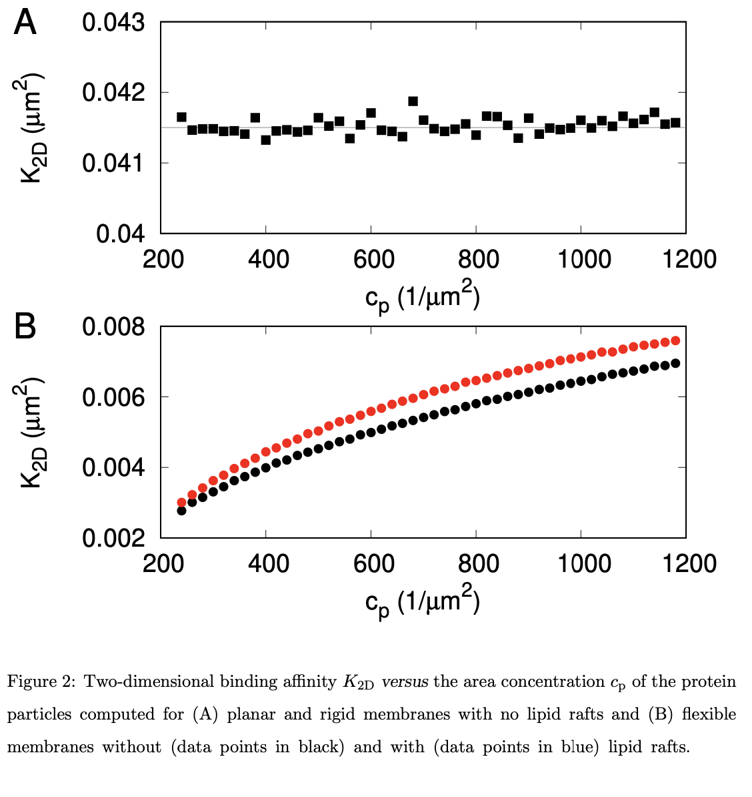

# Monte Carlo Adhesion Simulation

This repository contains the source code for a C++ application developed for mesoscopic Monte Carlo simulations using the Helfrich model to investigate biological membrane adhesion.

## Overview

Biological membrane adhesion is a complex phenomenon with significant implications in various fields such as cell biology and biophysics. This program allows researchers to simulate membrane adhesion processes at the mesoscopic level using Monte Carlo methods.

{width=50%}

{width=50%}
## Features

- **Mesoscopic Simulation:** Utilizes Monte Carlo methods to simulate membrane adhesion processes at the mesoscopic scale.
- **Helfrich Model:** Implements the Helfrich model, a widely used theoretical framework for studying membrane mechanics.
- **Publication Draft:** Detailed algorithm and simulation results are outlined in a publication draft currently submitted.
- **Visual Presentation:** Includes tools to generate impactful figures using vector graphics, enhancing the visual presentation of research results.
- **Configuration Loading:** The program includes a function for easier configuration loading. Snapshots are overwritten to separate files named `K_(...)_snapshot.txt`.
- **Snapshot History:** Configurations saved every few MC steps are stored in the file `K_(...)_snapshot_history.txt`.
- **Running with Previous Configuration:** Users can run the program with parameters from a previous configuration

## Getting Started

To get started with the Monte Carlo adhesion simulation, follow these steps:

1. Clone the repository: `git clone https://github.com/yourusername/monte-carlo-adhesion.git`
2. Navigate to the project directory: `cd monte-carlo-adhesion`
3. Compile the source code: `make`
4. Run the simulation: `./monte_carlo_adhesion`

- Use `./sim.o K_(...)_data.out K_(...)_snapshot.txt` to load parameters and configuration from previous files.
- To adjust equilibration steps (`nequil`) and MC steps (`ncyc`), use:
  ```
  ./sim.o K_(...)_data.out K_(...)_snapshot.txt $nequil $ncyc
  ```

For more information or inquiries, please contact lukaszmilevski@gmail.com.

## Publication

The detailed algorithm and simulation results are outlined in a publication draft currently submitted. For access to the publication draft or inquiries about the research findings, please contact lukaszmilevski@gmail.com

## Contributing

Contributions to the project are welcome! If you'd like to contribute, please fork the repository, make your changes, and submit a pull request.


